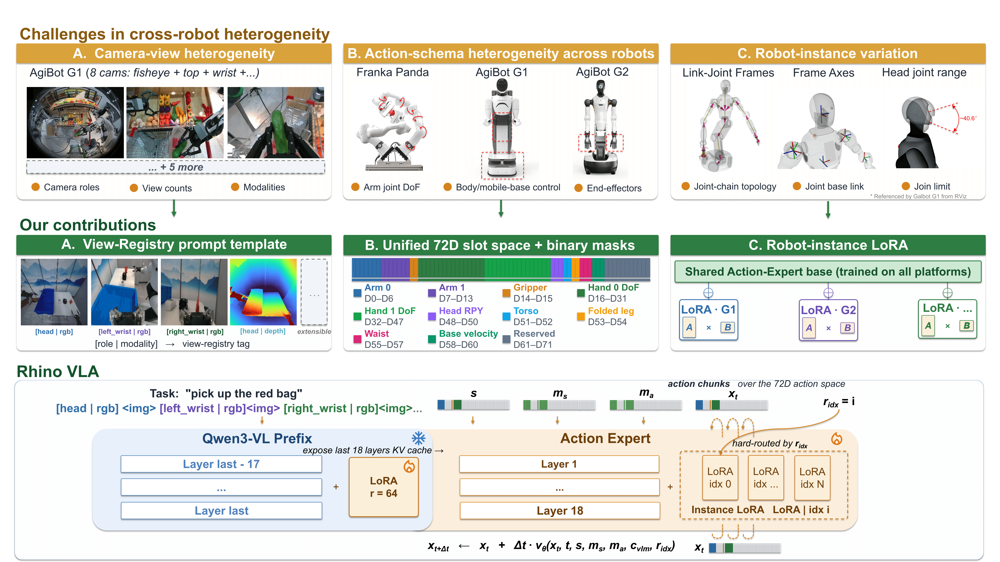

<p align="center">
  
</p>

<h1 align="center">
  
  RhinoVLA
</h1>

<p align="center">
  
  <a href="https://arxiv.org/abs/2606.07383"></a>
</p>

<p align="center">
  <b>中文</b> |
  <a href="./README_EN.md">English</a> |
  <a href="https://arxiv.org/abs/2606.07383">Paper</a>
</p>

<p align="center">
  <b>面向机器人端侧实时控制的跨本体 Vision-Language-Action 模型</b>
</p>

RhinoVLA 是辉羲智能自研的跨本体 VLA 系统，面向机器人本体端实时控制设计。技术报告展示了辉羲自研 VLA、辉羲 R1 芯片，以及智元、银河通用机器人组成的模型-芯片-机器人部署链路。

RhinoVLA 在辉羲 R1 芯片上实现了 **11.69Hz** 端到端推理频率，跨过机器人实时闭环控制常用的 10Hz 门槛。同时，RhinoVLA 通过统一状态-动作接口和实例适配机制，支持同一策略迁移到不同机器人平台。

## 主要特性

- **端侧实时部署**：围绕机器人本体端运行设计，在 R1 芯片上实现实时 VLA 推理。
- **算法-系统联合优化**：采用 Qwen3-VL Backbone + Action Expert 结构，并结合芯片、算子和运行时优化降低端侧开销。
- **跨本体适配**：通过 View Registry、72D 状态-动作接口和 Instance LoRA 处理视觉输入、动作接口和机器人实例差异。

<p align="center">
  
</p>

## 🚀 快速开始 Quickstart

训练环境、数据 mapping、checkpoint 路径和启动脚本配置请参考 [Finetuning Guide](docs/FINETUNING_GUIDE.md)。
数据准备见 [数据准备指南](docs/DATA_PREPARATION.md)。

### 预训练权重

预训练参数统一从 Hugging Face 下载: [HuixiAI/RhinoVLA](https://huggingface.co/HuixiAI/RhinoVLA)。
Hugging Face 仓库提供默认训练配置使用的 `rhinovla_pretrain.ckpt`。
也可从 ModelScope 下载: [huixiAI/RhinoVLA](https://www.modelscope.cn/models/huixiAI/RhinoVLA)。

下载到本仓库的 `checkpoints/` 后即可微调。默认配置加载
`trainer.pretrained_checkpoint: checkpoints/rhinovla_pretrain.ckpt`。
权重的 model card、license 和使用限制以 Hugging Face 仓库页面为准。

### 仓库结构

- `rhinovla/`：核心 Python 包，包含模型框架、Qwen3-VL 封装、Action Expert、LeRobot 数据加载和训练逻辑。
- `rhinovla/assets/qwen3_vl_processor/`：本地 Qwen3-VL processor / tokenizer 配置。
- `configs/training/`：训练配置，包括 Action Expert 微调、全参微调。
- `configs/data_mappings/`：LeRobot v3 原始 state/action 字段到 RhinoVLA 72D slots 的 mapping。
- `datasets/example_lerobot_v3/`：可直接跑通 `demo_ae_finetune.yaml` 的最小 LeRobot v3 示例数据。
- `checkpoints/`：预训练权重。
- `scripts/train/`：训练启动脚本。
- `docs/`：微调说明文档。

## 🎬 演示 Demo

### Galbot G1：指令跟随

RhinoVLA 运行在银河 G1 与辉羲 R1 芯片上，连续执行三次自然语言指令。

<div align="center">
  <video src="https://github.com/user-attachments/assets/5cc67652-53a8-49a0-a38c-08ae5fc38f68" width="100%" controls></video>
</div>

### AgiBot G2：长程任务

RhinoVLA 运行在智元 G2 与辉羲 R1 芯片上，通过一次长指令完成多步骤任务。

<div align="center">
  <video src="https://github.com/user-attachments/assets/04499b63-fefd-498d-8bd2-fdab28c1c2dd" width="100%" controls></video>
</div>

### AgiBot G1：双臂叠毛巾

RhinoVLA 运行在智元 G1 与辉羲 R1 芯片上，完成双臂柔性物体操作。

<div align="center">
  <video src="https://github.com/user-attachments/assets/de229167-6e2d-4e5c-849c-334d9d6800ab" width="100%" controls></video>
</div>

## 📦 Release Plan

- [x] 模型训练代码
- [x] 模型参数

## 📄 Citation

如果 RhinoVLA 对你的研究有帮助，请引用我们的技术报告：

```bibtex
@misc{intelligence2026rhinovlatechnicalreport,
      title={RhinoVLA Technical Report},
      author={Huixi Intelligence and Chen Zhang and Chenyang Zhou and Guanglei Ding and Guanghui He and Haibin Gao and Jiajia Chen and Jianyong Zhang and Lianyi Yu and Ningyi Xu and Ping Xu and Qingchen Li and Yingjun Hu and Yijia Zhang and Yuxi Liu},
      year={2026},
      eprint={2606.07383},
      archivePrefix={arXiv},
      primaryClass={cs.RO},
      url={https://arxiv.org/abs/2606.07383},
}
```

## ⚖️ License

本项目采用 Apache-2.0 License。第三方组件和随仓库提供的第三方资源文件的许可证与来源见
[THIRD_PARTY_NOTICES.md](THIRD_PARTY_NOTICES.md)。

## 💬 Contact

微信公众号：

<p align="left">
  
</p>

## Acknowledgments

RhinoVLA 的视觉语言模型部分参考并使用了 [Qwen3-VL](https://github.com/QwenLM/Qwen3-VL)。
感谢相关团队开源高质量的多模态模型和 processor。
